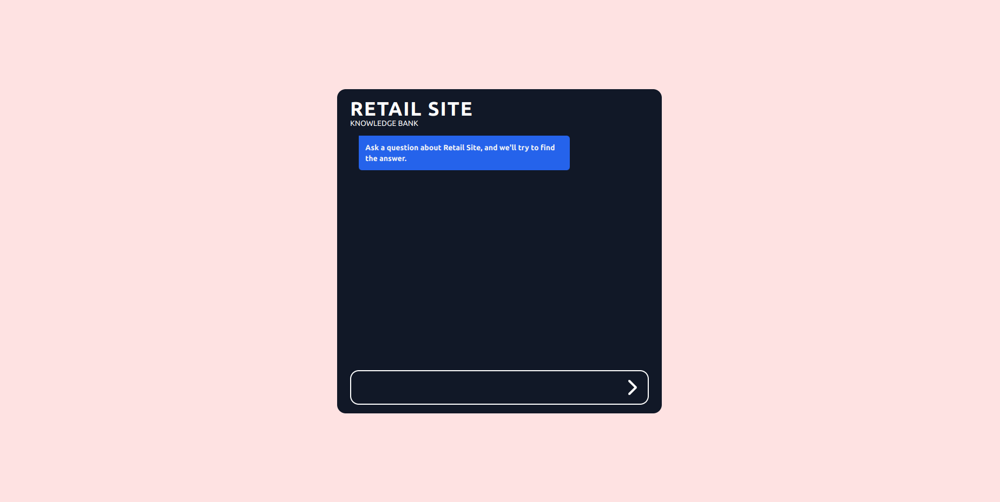
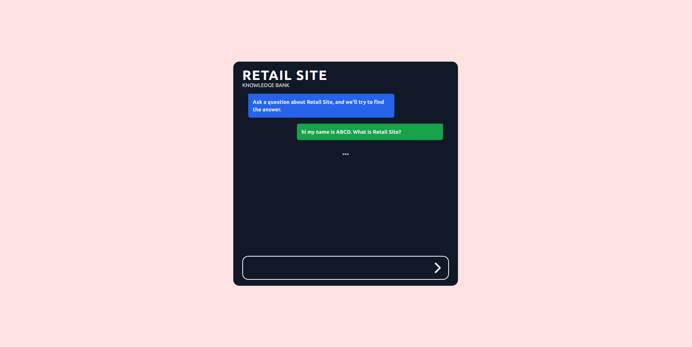
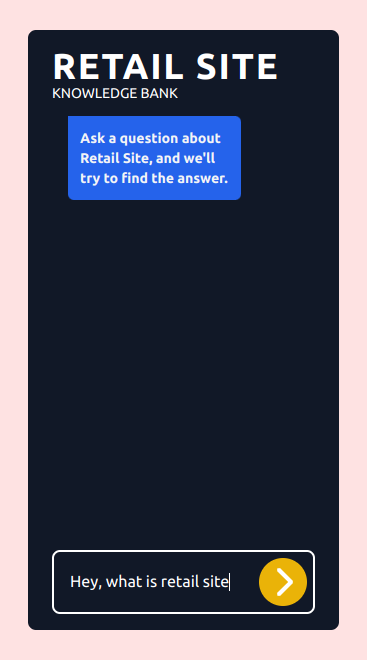
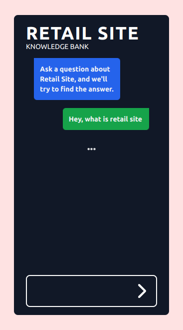

# (Retail Site) Knowledge Bank

This is a project to show how to make knowledge bank of a site or something similar. Using this knowledge bank, the user can ask the AI for information.

<p float="left">
  
  
</p>
<p float="left">
  
  
</p>

## Services Used

- OpenAI
- Supabase

## Languages, Frameworks and Libraries Used

- Typescript
- Vite
- Tailwind CSS
- Langchain

## Environment Variables

```sh
VITE_SUPABASE_API_KEY
VITE_SUPABASE_URL
VITE_OPENAI_API_KEY
```
